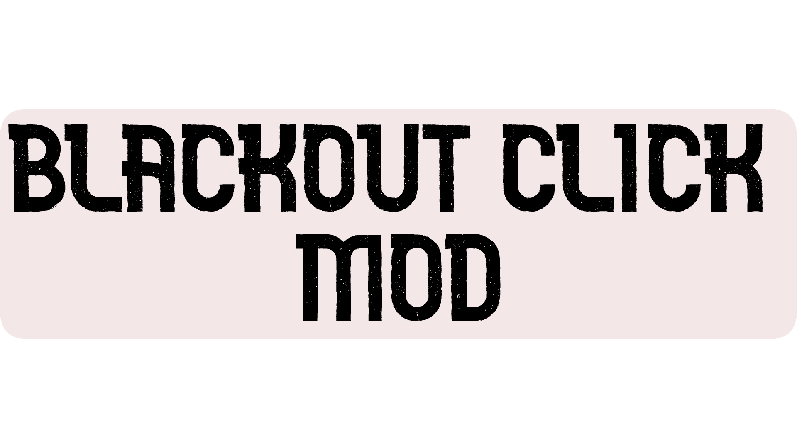

# BlackoutClick
A Geometry Dash mod that blacks out your screen after every click for an immersive challenge experience.

## What is BlackoutClick?

BlackoutClick is a Geometry Dash mod that adds an intense challenge layer to your gameplay experience. Every time you click or tap during a level, your screen will temporarily black out, forcing you to rely on memory, timing, and muscle memory to navigate through levels.

## Customization Options

The mod provides two main settings to tailor your experience:

1. **Blackout Duration**: Fine-tune how long the screen stays black (0-5 seconds)
2. **Blackout Color**: Choose any color for the overlay effect, including transparency (if you're a baby)

## Resources
* [Geode SDK Documentation](https://docs.geode-sdk.org/)
* [Geode SDK Build Instructions](https://docs.geode-sdk.org/getting-started/create-mod#build)
* [Geode SDK Source Code](https://github.com/geode-sdk/geode/)
* [Geode CLI](https://github.com/geode-sdk/cli)
* [Bindings](https://github.com/geode-sdk/bindings/)
* [Dev Tools](https://github.com/geode-sdk/DevTools)

## Developer
Created by **BookCatKid**
